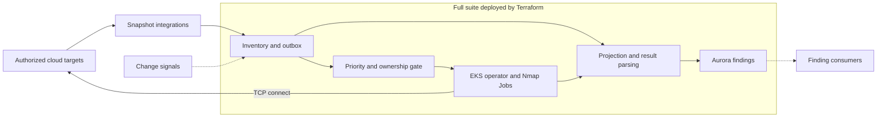

<!--
SPDX-FileCopyrightText: 2026 Portscanner contributors
SPDX-License-Identifier: MIT
-->

# Portscanner

Cloud exposure changes in minutes. A public IP appears, a security group
changes, or a service opens—often long before the next scheduled scanner
sweep. Event streams are fast but incomplete; snapshots are complete but
slower.

Portscanner uses both. It continuously discovers Internet-facing cloud assets,
moves new and changed doors to the front of the line, verifies current
ownership immediately before scanning, and turns outside-in evidence into
durable findings.

For the story behind the design, watch
[Minutes from Malice](https://tinyurl.com/minutes-from-malice).

> Only scan assets you own or are explicitly authorized to test. The AWS
> deployment creates services that incur charges. Account inventory stays
> paused until you define target scope and activate it.

## How it works

1. **Discover** authoritative cloud inventory.
2. **Prioritize** new and changed targets without starving the baseline sweep.
3. **Verify** current ownership, then run a bounded Nmap Job from outside.
4. **Act** on complete evidence; failed or partial work remains `UNKNOWN`.



## What you get

Terraform deploys the complete self-hosted suite—not just a scanner:

- VPC, NAT, EKS, Aurora PostgreSQL, ECR, KMS, Secrets Manager, logs, alarms,
  and encrypted Terraform state.
- Inventory, snapshot, signal, outbox, generator, parser, projector, processor,
  and migration Lambdas.
- A namespace-scoped Helm operator, bounded Nmap Jobs, quotas, rate limits, and
  immutable result storage.
- Generation-safe target, exposure, and finding state with optional S3/SQS
  export.

AWS Config, CloudTrail hints, multi-account roles, and finding export are
created only when you enable those integrations.

## Getting started

Use a dedicated AWS sandbox and standard AWS CLI credentials. The bootstrap
script checks the exact Terraform, Docker, Trivy, `jq`, Python, Git, and `tar`
requirements.

Copy the single environment file:

```sh
cp terraform/aws/deployment/environment.auto.tfvars.json.example \
  terraform/aws/deployment/environment.auto.tfvars.json
$EDITOR terraform/aws/deployment/environment.auto.tfvars.json
```

Deploy the full suite and run the quickstart:

```sh
./terraform/aws/scripts/bootstrap.sh
./terraform/aws/scripts/deploy.sh evaluate
```

Bootstrap creates remote state, deploys the paused foundation, and builds,
scans, and publishes immutable images. The quickstart installs the runtime,
migrates PostgreSQL, scans an isolated one-port target, verifies the resulting
finding, and returns dispatch to paused state.

Each apply displays and requires confirmation of an exact saved plan. See the
[AWS deployment README](terraform/aws/README.md) for prerequisites, costs,
recovery, retention, and destruction.

## Bring your targets and cloud signals

After the quickstart succeeds, edit the same environment JSON:

1. **Targets:** add authorized account IDs, public CIDRs, ENI classes, and
   opt-in tags.
2. **Snapshots:** use direct EC2 snapshots for the simplest AWS setup, or
   connect an AWS Config aggregator. Snapshots remain authoritative.
3. **Change signals:** enable native EventBridge state changes and optional
   CloudTrail API hints. Signals trigger a current-state reread; they never
   prove ownership by themselves.
4. **Findings:** keep PostgreSQL as the boundary, or enable immutable S3/SQS
   export for downstream consumers.

Then review and activate:

```sh
./terraform/aws/scripts/deploy.sh activate
./terraform/aws/scripts/deploy.sh pause
```

To add another cloud, implement its snapshot, signal-resolution, and ownership
interfaces described in [inventory/README.md](inventory/README.md). The
scanner and findings pipeline stay unchanged.

## Safety and scope

Account, CIDR, profile, rate, Pod, and Job limits bound dispatch. Portscanner
rereads provider ownership immediately before creating a scan. Stale,
ambiguous, failed, or incomplete evidence never silently closes an exposure.

Version 1.0 supports self-hosted AWS, public IPv4 EC2 targets, TCP connect
scanning, Kubernetes orchestration, and PostgreSQL findings. It does not
authorize Internet-wide scanning, support private/IPv6 targets, provide
production-ready GCP/Azure adapters, or perform automatic remediation.

## Develop locally

Local checks never scan a target:

```sh
make sync
make check
```

`make ci` adds PostgreSQL, Go/envtest, Terraform, Helm, and publication checks.

Implementation details live beside the code: [Terraform](terraform/aws/README.md),
[inventory](inventory/README.md), [contracts](contracts/README.md),
[generator](generator/README.md), [operator](operator/README.md),
[scanner](scanner/nmap/README.md), and [database migrator](db/migrator/README.md).

Portscanner is MIT licensed. Report vulnerabilities through
[SECURITY.md](SECURITY.md), and review
[THIRD_PARTY_NOTICES.md](THIRD_PARTY_NOTICES.md) for bundled dependencies.
