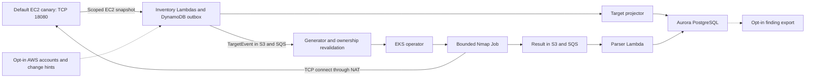

<!--
SPDX-FileCopyrightText: 2026 Portscanner contributors
SPDX-License-Identifier: MIT
-->

# Portscanner

Portscanner is a self-hosted system for continuously verifying the
Internet-facing ports of cloud assets you are authorized to test. It discovers
current AWS ownership, dispatches bounded Nmap Jobs in Kubernetes, and stores
generation-safe exposures and findings in PostgreSQL.

> Only scan assets you own or are explicitly authorized to test. The AWS
> evaluation creates EKS, Aurora, NAT, EC2, queues, buckets, and supporting
> services that incur charges. Only the managed-canary evaluation briefly
> enables dispatch; account inventory stays paused until you activate it.

## Architecture at a glance

The solid path is the default one-target evaluation; dashed paths require
explicit opt-in. Snapshots are authoritative and change signals only trigger a
current-state reread. For the design motivation, watch
[Minutes from Malice](https://tinyurl.com/minutes-from-malice).



## Try it locally

Local checks do not scan a network target. Install Python 3.12, `uv`, Go, and
Docker, then run:

```sh
make sync
make check
```

`make ci` adds PostgreSQL, Go/envtest, Terraform, Helm, and publication checks.
Contributions must use synthetic fixtures, preserve authorization and
`UNKNOWN` semantics, commit generated outputs, and pass `make ci`. New source
adapters must follow [inventory/README.md](inventory/README.md).

## Evaluate the AWS stack

The canonical evaluation creates its own low-cost VPC and a small isolated EC2
canary that exposes only TCP 18080 to the scanner's NAT address. It never scans
localhost, an arbitrary public host, or the rest of your account.

Install the versions checked by the bootstrap script, configure the standard
AWS CLI credential chain, and copy the environment template:

```sh
cp terraform/aws/deployment/environment.auto.tfvars.json.example \
  terraform/aws/deployment/environment.auto.tfvars.json
$EDITOR terraform/aws/deployment/environment.auto.tfvars.json
```

The JSON file is the only user-maintained deployment configuration. It contains
non-secret account, Region, access, capacity, retention, and integration
policy; credentials stay outside Terraform variables.

Deploy and evaluate:

```sh
./terraform/aws/scripts/bootstrap.sh
./terraform/aws/scripts/deploy.sh evaluate
```

Bootstrap verifies the live AWS identity, creates remote state, applies a
paused foundation, and builds, scans, and publishes immutable images.
Evaluation migrates PostgreSQL, installs the Helm operator, runs one targeted
canary scan, verifies its finding, and returns dispatch to paused state.
Each saved Terraform plan still requires an explicit confirmation.

Read [terraform/aws/README.md](terraform/aws/README.md) before applying. It
covers exact prerequisites, costs, failure recovery, emergency pause, data
retention, and guarded destruction.

## Next steps

After the canary succeeds:

1. Add explicit AWS account, CIDR, ENI class, and opt-in tag scope to the same
   environment JSON.
2. Enable periodic snapshots, review the plan, and activate the integration.
3. Optionally add Config/CloudTrail hints, multi-account collection, or S3/SQS
   finding export; retire the managed canary when it is no longer needed.

```sh
./terraform/aws/scripts/deploy.sh activate
./terraform/aws/scripts/deploy.sh pause
```

Activation is never implied by installation. Signals only accelerate work;
authoritative snapshots and immediate provider ownership rereads remain the
scan gate.

## Safety model

Inventory records stable target generations, and the generator rereads current
provider ownership immediately before creating a digest-pinned Scanner Job.
Explicit account, CIDR, profile, rate, Pod, and Job limits bound dispatch;
failed or incomplete evidence remains `UNKNOWN` and never silently closes an
exposure.

## Supported scope

The 1.0 release supports self-hosted AWS, public IPv4 EC2 targets, TCP
connect scanning, Kubernetes orchestration, and PostgreSQL findings. It does
not authorize Internet-wide scanning, support private/IPv6 targets, provide
production-ready GCP/Azure adapters, remediate resources, or promise a
universal detection-time SLO.

## Components

- [Terraform AWS deployment](terraform/aws/README.md)
- [Inventory and source adapters](inventory/README.md)
- [Contracts and finding consumers](contracts/README.md)
- [Generator](generator/README.md)
- [Kubernetes operator](operator/README.md)
- [Nmap scanner](scanner/nmap/README.md)
- [Database migrator](db/migrator/README.md)

Synthetic contracts are in `examples/`; generated JSON Schemas are in
`schemas/`.

## Project policy

Portscanner is MIT licensed. Report vulnerabilities privately through
[SECURITY.md](SECURITY.md), and review
[THIRD_PARTY_NOTICES.md](THIRD_PARTY_NOTICES.md) for bundled dependencies.
